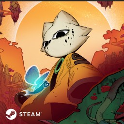

# doc-assets

Assets used in the documentation, refer to [the REUSE.toml file](REUSE.toml) for licensing related information.

## Assets featured

The following are the assets featured in this directory:

### (Nine Sols 1:1 icon)

A 1:1 aspect ratio icon suitable to be used in places with such size restraint.

#### Source

[九日 | Steam Key 組合包](https://shop.redcandlegames.com/zh-TW/bundles/nine-sols-steam-key-bundle)

### (Nine Sols icon)

Long aspect ratio logo/icon of Nine Sols.

#### Source

[Nine Sols - Press Kit - Red Candle Games](https://redcandlegames.com/presskit/sheet.php?p=nine%20sols)
